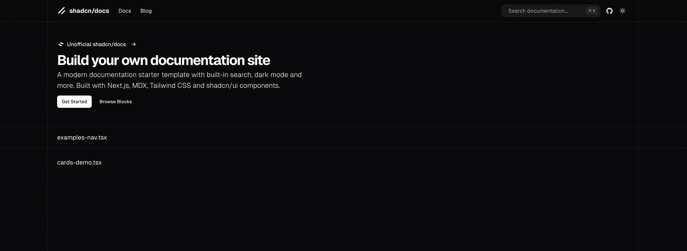

# shadcn/docs

A comprehensive documentation site built with MDX and shadcn/ui components.

## Overview

This repository contains the documentation for a collection of reusable components built with shadcn/ui, MDX, and React. It demonstrates how to combine Markdown with React components to create rich, interactive documentation.

## Contributing

We welcome contributions to improve the documentation! Here's how you can help:

1. Fork the repository and create your branch from `master`
2. Make your changes following our code style and documentation guidelines
3. Test your changes locally to ensure they render correctly
4. Submit a pull request with a clear description of your changes
5. Wait for review and address any feedback

Please ensure your contributions:

- Follow the existing documentation structure and style
- Include clear, concise explanations
- Maintain accessibility standards
- Add examples where appropriate
- Update relevant navigation/config files if adding new pages

For major changes, please open an issue first to discuss what you would like to change.
